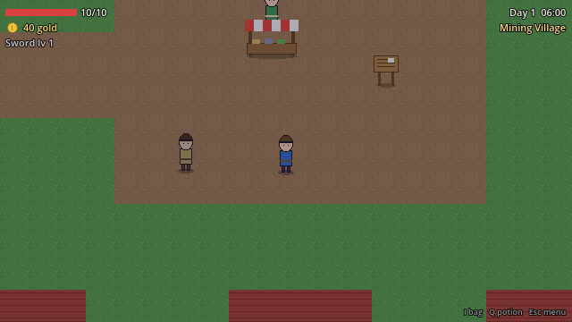
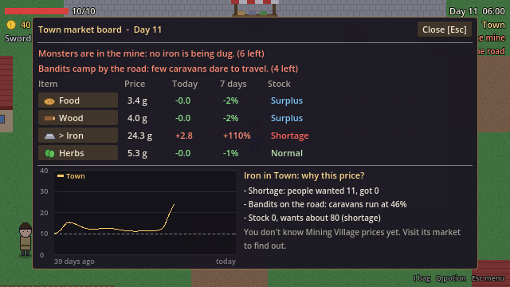

# Rippleborne

An indie economic game: pixel 2D 3/4 top-down, system-driven RPG. Single-player, PC/Steam first.

> Don't give the player a goal. Give them a world.




## Chạy game

1. Mở Godot **4.7.1**, bấm **Import**, chọn `project.godot` trong thư mục này.
2. Bấm **F5**, chọn **New game**.

| Phím | Tác dụng |
|---|---|
| WASD / mũi tên | Di chuyển |
| Space / J / chuột trái | Chém (3 lần liên tiếp = combo, chuột nhắm theo con trỏ) |
| Shift / K | Dash |
| E | Nói chuyện, mua bán, hái, đào |
| I / Tab | Túi đồ |
| Q | Uống thuốc |
| Esc | Menu (lưu, tải, hướng dẫn, bật/tắt nhạc) |
| F12 | Debug panel |

Hướng dẫn chơi thử và giải thích hệ thống: [docs/huong-dan/03-v0.1.md](docs/huong-dan/03-v0.1.md).

## Test tự động

Mở một trong các scene dưới đây rồi bấm **F6**, kết quả hiện ở tab Output:

- `tests/test_simulation.tscn`: kinh tế, sự kiện, save (chạy 10.000 ngày)
- `tests/test_gameplay.tscn`: chơi thật trong scene chính (di chuyển, combo, quái, nhặt đồ, mua bán, dọn mỏ, save)

Không cần mở cửa sổ game: `godot --headless --path . tests/test_simulation.tscn`

Sandbox kinh tế (xem giá mà không cần chơi): `game/economy/sandbox/economy_sandbox.tscn`, bấm F6.

## Cấu trúc thư mục

```text
game/
  infrastructure/   EventBus, GameClock, Game (trạng thái), SaveManager, Sfx, Feel
  economy/          Commodity, Market, Settlement, EconomySystem, sandbox
  world/            WorldState, EventSystem, bản đồ, NPC, điểm hái lượm, ngày/đêm
  combat/           Hitbox, Hurtbox, Enemy, EnemySpawner
  items/            ItemData, Inventory, ItemPickup
  player/           Player, PlayerState
  ui/               HUD, các cửa sổ, màn hình tiêu đề
  main.tscn         Scene chơi chính
assets/             Ảnh, âm thanh (placeholder)
data/               Số liệu cân bằng (.tres): commodities, businesses, settlements, enemies, events, items
tests/              Test tự động
tools/              generate_world.gd (dựng lại bản đồ từ đầu)
docs/huong-dan/     Giải thích từng bước đã làm
NOT_NOW.md          Ý tưởng để dành, chưa làm trong v0.1
```

## Git workflow

- `main`: bản ổn định, chơi được
- `develop`: nơi gộp các tính năng đã test
- `feature/*`: mỗi tính năng một nhánh, test xong mới gộp vào `develop`
- Tag mốc: `v0.0.1`, `v0.0.5`, `v0.1`

## Tiến độ

- [x] Tuần 1: Foundation ([giải thích](docs/huong-dan/01-foundation.md))
- [x] Sandbox kinh tế ([giải thích](docs/huong-dan/02-economy-sandbox.md))
- [x] v0.1: thế giới, combat, vật phẩm, kinh tế 4 hàng hóa, sự kiện, Market Board, save ([giải thích](docs/huong-dan/03-v0.1.md))
- [x] Gói A: cảm giác điều khiển, combo, hiệu ứng, nhạc ([giải thích](docs/huong-dan/04-cam-giac-dieu-khien.md))
- [ ] Gói B: thị trường sống động hơn
- [ ] Chơi thử và quyết định theo Decision Gate (PDF mục 16)
