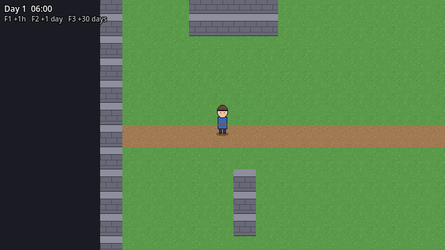

# Bước 1: Foundation (tuần 1)

Mục tiêu tuần 1 theo Implementation Plan: **"Đi lại được trong map"**, cùng với nền móng
GameClock + EventBus mà mọi hệ thống sau này sẽ dùng.



## Cách kiểm tra (bạn làm)

Mở project trong Godot 4.7.1 rồi bấm **F5**, sau đó thử:

- [ ] Nhân vật đi được 8 hướng bằng WASD hoặc phím mũi tên, camera đi theo.
- [ ] Đi vào tường xám thì bị chặn lại.
- [ ] Góc trên bên trái hiện `Day 1  06:00`, cứ khoảng 10 giây thì tăng 1 giờ.
- [ ] F1 tăng 1 giờ, F2 tăng 1 ngày, F3 tăng 30 ngày.

Nếu cả 4 mục đều ổn, bạn báo mình để gộp nhánh và làm bước tiếp theo.

---

## Đã làm những gì

### 1. Cài đặt project (`project.godot`)

- **Màn hình game 640×360.** Game được vẽ ở độ phân giải này rồi phóng to theo *số nguyên*
  (`stretch mode = viewport`, `scale mode = integer`). Cửa sổ mặc định 1280×720 (×2),
  toàn màn hình 1920×1080 (×3). Nhờ phóng số nguyên nên pixel luôn vuông, không bị méo.
- **Texture filter = Nearest**: ảnh pixel giữ cạnh sắc, không bị nhòe.
- **Snap 2D transforms to pixel**: vị trí vẽ được làm tròn về pixel, tránh rung hình.
- **Renderer = Compatibility**: nhẹ nhất, chạy tốt trên laptop phổ thông, đủ cho game 2D.
- **Tên physics layer**: 1 World, 2 Player, 3 Enemy, 4 Hitbox. Tường nằm ở layer World;
  Player nằm ở layer Player và chỉ va chạm (mask) với World.

### 2. Thư mục

Theo cấu trúc trong PDF (`game/`, `data/`, `tests/`, `tools/`, `NOT_NOW.md`). Mình thêm
`assets/` để chứa ảnh, vì PDF chưa có chỗ cho ảnh. Các thư mục còn trống có file `.gitkeep`,
vì git không lưu thư mục rỗng.

### 3. EventBus (`game/infrastructure/event_bus.gd`)

Đây là "bảng thông báo" chung của cả game. File này chỉ chứa **signal**, không chứa logic.

```gdscript
signal hour_advanced(day: int, hour: int)
signal day_advanced(day: int)
```

- Hệ thống nào có tin thì **phát** (`EventBus.day_advanced.emit(day)`).
- Hệ thống nào quan tâm thì **nghe** (`EventBus.day_advanced.connect(...)`).
- Hai bên không cần biết nhau. Sau này ProductionSystem và MarketSystem chỉ cần nghe
  `day_advanced`, còn GameClock không phải sửa gì. Đây là "dependency rule" trong PDF:
  combat không tự đổi giá sắt, nó chỉ báo "mỏ đã sạch", phần còn lại tự phản ứng.

`@warning_ignore("unused_signal")` chỉ để Godot khỏi cảnh báo "signal khai báo mà không dùng
trong file này". Với EventBus thì chuyện đó là bình thường.

### 4. GameClock (`game/infrastructure/game_clock.gd`)

Giữ thời gian trong game: `day` và `hour`, bắt đầu từ ngày 1, 6 giờ sáng.

- `seconds_per_hour = 10.0`: 10 giây thật bằng 1 giờ trong game, nên 1 ngày dài 4 phút.
  Muốn nhanh hay chậm hơn thì chỉ cần sửa số này.
- Mỗi khi qua 1 giờ thì phát `hour_advanced`. Qua 0 giờ thì phát thêm `day_advanced`.
- `advance_time(hours)` dùng để tua nhanh (phím debug, sau này là đi ngủ).
- Di chuyển và đánh nhau **không** dùng đồng hồ này, vì chúng chạy mỗi frame.
  Kinh tế sẽ chạy theo giờ/ngày, như PDF mục 6.2.

**Autoload** nghĩa là Godot tự tạo node này khi game chạy và giữ nó suốt game, nên ở bất kỳ
script nào cũng gọi được `GameClock.day` hay `EventBus.day_advanced`. Bạn xem danh sách ở
*Project → Project Settings → Globals → Autoload*.

### 5. Player (`game/player/`)

```gdscript
var direction := Input.get_vector("move_left", "move_right", "move_up", "move_down")
velocity = direction * speed
move_and_slide()
```

- `Input.get_vector` đọc 4 phím và trả về hướng đã chuẩn hóa, nên đi chéo không nhanh hơn đi thẳng.
- `move_and_slide()` di chuyển và tự trượt dọc theo tường khi va chạm.
- `speed = 120` pixel/giây, gần 4 ô mỗi giây. Có `@export` nên bạn chỉnh được trong Inspector.
- **Motion mode = Floating**: chế độ dành cho game nhìn từ trên xuống (không có "sàn" hay "trần").
- **Gốc tọa độ đặt ở chân nhân vật**, hộp va chạm 20×10 cũng chỉ ở chân. Đây là mẹo của góc
  nhìn 3/4: thứ chạm tường là bàn chân, còn đầu thì được phép vẽ đè lên tường phía sau.
  Sau này bật Y-sort, Godot sẽ dựa vào vị trí chân để biết ai đứng trước ai.
- `Camera2D` là con của Player nên tự đi theo.

### 6. Phòng test (`game/world/`)

- `tileset.tres`: bộ ô 32×32 gồm 3 loại: cỏ, đường đất, tường đá. Chỉ ô tường có hình va chạm.
- `test_room.tscn`: 2 lớp **TileMapLayer**. `Ground` là nền (cỏ, đất), `Walls` là tường.
  Tách lớp để sau này thêm cây, nhà mà không đè mất nền.
- **Tự vẽ thêm**: mở `test_room.tscn`, chọn node `Walls`, mở tab **TileMap** ở dưới đáy
  editor, chọn ô tường rồi click lên map. Chuột phải để xóa.

Ảnh nhân vật và ô đất đều là placeholder do mình vẽ tạm (`assets/`). Sau này thay ảnh thật
thì chỉ cần thay file PNG.

### 7. DebugOverlay (`game/ui/`)

Một `CanvasLayer` (lớp UI luôn nằm trên cùng, không bị camera kéo đi) có 2 Label.

- Nó **nghe** `EventBus.hour_advanced` để cập nhật chữ, chứ GameClock không tự sửa UI.
  Đây là ví dụ đầu tiên của "UI chỉ hiển thị, không chứa logic".
- F1/F2/F3 gọi `GameClock.advance_time(...)`. Các phím này nằm trong
  *Project Settings → Input Map* với tên `debug_advance_hour`, `debug_advance_day`,
  `debug_advance_30_days`.

---

## Giới hạn đã biết (chưa làm, có chủ đích)

- **Chưa có Y-sort**: khi đứng ngay phía trên một khối tường, nhân vật vẫn được vẽ đè lên
  tường thay vì bị che. Việc này sẽ sửa khi thêm cây và nhà.
- **Camera chưa có giới hạn**: đi sát mép phòng sẽ thấy vùng tối bên ngoài.
- **Chưa có animation**: nhân vật chưa có hoạt ảnh đi bộ 4 hướng.

## Git

- `main`: chỉ có commit README ban đầu.
- `develop`: tạo từ `main`.
- `feature/week1-foundation`: toàn bộ bước này. Sau khi bạn test xong thì gộp vào `develop`.

## Đã kiểm tra tự động

Mình chạy game ở chế độ không cửa sổ (headless) bằng Godot 4.7.1, giả lập bấm phím và kiểm tra:
đi phải 1 giây được 118 px, đi lên thì dừng đúng ở mép tường, F2 tăng đúng 1 ngày
(1 `day_advanced`, 24 `hour_advanced`), Label cập nhật theo signal, tua 1000 ngày không lỗi.
Kết quả 8/8 đạt.

## Bước tiếp theo

Sandbox kinh tế (theo lựa chọn 3a): 1 hàng hóa là sắt, 2 chợ, nút "Qua ngày",
nút "Quái chiếm mỏ / Dọn mỏ". Nó sẽ dùng luôn GameClock và EventBus vừa làm.
