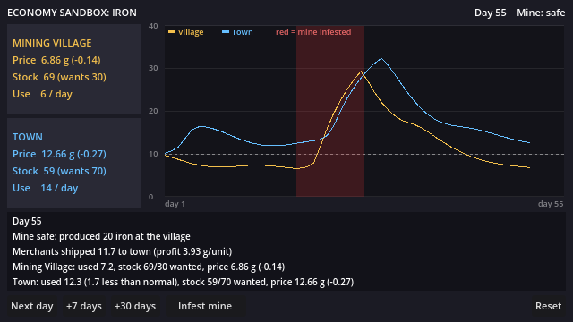

# Bước 2: Sandbox kinh tế

> **Ghi chú (v0.1):** mô hình trong bài này sau đó được mở rộng thành `EconomySystem` với 4 hàng hóa và 2 chợ
> (xem [03-v0.1.md](03-v0.1.md)). Các file `economy_simulation.gd` và `sandbox_config.tres` nhắc tới bên dưới không còn nữa;
> sandbox bây giờ hiển thị kinh tế thật của game. Công thức giá và ý tưởng vẫn giữ nguyên.

Mục tiêu: thử **sớm** bài test quan trọng nhất trong Memory.md, trước khi tốn công vào combat:

> Dọn mỏ → sản lượng sắt tăng → nguồn cung sắt tăng → giá sắt giảm dần.

Chỉ có 1 hàng hóa (sắt), 2 chợ (Mining Village và Town), 1 mỏ, 1 tuyến buôn. Chưa có nhân vật
hay đánh nhau: nút "Infest mine / Clear mine" đóng vai quái chiếm mỏ và người chơi dọn mỏ.



## Cách chạy và thử (bạn làm)

Mở `game/economy/sandbox/economy_sandbox.tscn` trong Godot rồi bấm **F6** (chạy scene đang mở).

1. Bấm **+30 days** vài lần. Giá ổn định quanh 6.4 g ở làng mỏ và 12.5 g ở thị trấn.
2. Bấm **Infest mine**, rồi **Next day** từng ngày. Giá ở làng tăng ngay. Thị trấn thì phải vài
   ngày sau mới tăng, vì còn hàng tồn kho và thương nhân vẫn chở nốt số sắt còn lại.
3. Bấm **+7 days**, sau đó **Clear mine**. Giá không tụt ngay mà giảm dần trong khoảng 3 đến 4 tuần.
4. Khung dưới biểu đồ giải thích mỗi ngày "tại sao giá đổi": mỏ sản xuất bao nhiêu, thương
   nhân chở bao nhiêu, mỗi nơi dùng bao nhiêu.

**Câu hỏi cho bạn** (đây là điểm dừng trong plan): cảm giác này có "đã" không? Giá lên có đủ mạnh
không, thời gian trễ có hợp lý không? Muốn thử số khác thì bấm vào
`data/economy/sandbox_config.tres` hoặc `data/commodities/iron.tres`, sửa số trong Inspector
rồi chạy lại. Không cần sửa code.

---

## Mô hình chạy thế nào

Mỗi ngày trong game chạy đúng 4 bước theo thứ tự:

| Bước | Chuyện gì xảy ra | Số mặc định |
|---|---|---|
| 1. Sản xuất | Mỏ an toàn thì thêm sắt vào kho làng mỏ, bị chiếm thì không có gì | 20 sắt/ngày |
| 2. Buôn bán | Lãi mỗi đơn vị = giá thị trấn − giá làng − phí chở. Lãi vượt ngưỡng thì thương nhân chở, lãi càng cao chở càng nhiều | phí 2 g, ngưỡng 1 g, tối đa 20/ngày |
| 3. Tiêu thụ | Mỗi nơi dùng sắt. Giá cao thì dùng ít đi, giá rẻ thì dùng nhiều hơn (0.5 đến 1.5 lần) | làng 6, thị trấn 14 mỗi ngày |
| 4. Giá | Giá đi dần về "giá mục tiêu", được tính từ lượng hàng trong kho | xem dưới |

**Công thức giá** (mục 9.1 trong PDF):

```text
kho mong muốn = nhu cầu mỗi ngày × 5 ngày
tỉ lệ         = kho mong muốn / kho hiện có
giá mục tiêu  = giá gốc × tỉ lệ ^ 0.6        (kẹp trong khoảng 4 g đến 40 g)
giá mới       = giá cũ + (giá mục tiêu − giá cũ) × 15%
```

Ví dụ: thị trấn muốn giữ 70 sắt nhưng chỉ còn 35 thì tỉ lệ là 2, giá mục tiêu là 10 × 2^0.6 ≈ 15.2 g.
Mỗi ngày giá chỉ đi 15% quãng đường còn lại, nên không bao giờ nhảy đột ngột.

**Vì sao giá thị trấn luôn cao hơn làng khoảng 6 g?** Phải có chênh lệch thì thương nhân mới chịu
chở hàng. Đây chính là cơ hội "mua rẻ, chở đi, bán đắt" trong Memory.md (làng 8 g, thủ đô 19 g).

**Vì sao cần "giá cao thì dùng ít đi"?** Bản nháp đầu tiên của mình không có quy tắc này. Khi đó
sản xuất (20) đúng bằng tiêu thụ (6 + 14), nên số sắt mất đi lúc mỏ bị chiếm không bao giờ được bù
lại và giá kẹt ở mức cao mãi mãi. Khi người dùng biết tiết kiệm lúc đắt, kho dần đầy lại và giá
quay về mức cũ. Kinh tế thật cũng vận hành như vậy.

## Code nằm ở đâu

| File | Vai trò |
|---|---|
| `game/economy/commodity.gd` | Loại **Resource** mô tả một hàng hóa (giá gốc, độ co giãn...) |
| `data/commodities/iron.tres` | Số liệu của sắt, sửa được trong Inspector |
| `game/economy/economy_config.gd` + `data/economy/sandbox_config.tres` | Số liệu cân bằng của sandbox |
| `game/economy/market.gd` | Chợ sắt của một nơi: kho, nhu cầu, giá, lịch sử giá |
| `game/world/world_state.gd` | "Sự thật" về thế giới: mỏ có đang bị chiếm không |
| `game/economy/economy_simulation.gd` | Chạy 4 bước mỗi ngày và viết lời giải thích |
| `game/economy/sandbox/` | Màn hình sandbox và biểu đồ |
| `tests/test_economy.tscn` | Test tự động |

Ba nguyên tắc trong PDF được giữ:

1. **Sự kiện chỉ đổi WorldState, không đổi giá.** Nút "Infest mine" chỉ gọi
   `world.set_mine_infested(true)`. Giá thay đổi là do mỏ ngừng sản xuất, kho vơi đi, rồi công
   thức giá tự phản ứng. Sau này khi người chơi thật sự đánh quái trong mỏ, combat cũng chỉ gọi
   đúng hàm đó, và toàn bộ chuỗi phía sau vẫn chạy như cũ.
2. **Thời gian chỉ có một nguồn.** Sandbox không tự đếm ngày mà nghe
   `EventBus.day_advanced` từ GameClock. Các nút chỉ tua GameClock. Nếu để yên khoảng 4 phút,
   một ngày cũng tự trôi qua, nghĩa là thế giới vẫn chạy dù bạn không làm gì.
3. **Số liệu nằm trong data.** Muốn cân bằng lại thì sửa file `.tres`, không phải sửa code.

`WorldState` còn phát signal `EventBus.mine_state_changed`, để sau này HUD hay tin tức
("Quái vật chiếm mỏ phía bắc!") có thể nghe mà không cần biết ai đã gây ra.

**Resource** là kiểu dữ liệu của Godot để lưu số liệu thành file `.tres`. Nhấp đúp vào file là
Inspector hiện ra từng ô để sửa. Các dòng `@export` trong code chính là những ô đó.

**RefCounted** (dùng cho Market, WorldState, EconomySimulation) là object thường, không phải node
trong cây scene. Kinh tế không cần hiện lên màn hình, nên nó có thể chạy ở bất kỳ đâu, kể cả
trong test không có cửa sổ.

## Test tự động

Mở `tests/test_economy.tscn` rồi bấm **F6**. Kết quả hiện ở tab **Output** bên dưới. Có 7 kiểm tra:

- Chạy 900 ngày không có sự kiện: không có số NaN, không có kho âm, giá không vượt khung
- 100 ngày cuối: giá thị trấn đứng yên (thị trường đã cân bằng)
- 10 ngày mỏ bị chiếm: giá thị trấn tăng từ 12.53 lên 28.46
- Ngày đầu sau khi dọn mỏ: giá vẫn còn cao (30.19), không bị reset ngay
- 60 ngày sau khi dọn mỏ: giá về 12.28, gần mức cũ
- Không còn sắt ở đâu trong 50 ngày: giá dừng ở mức trần 40 g
- 10.000 ngày với sự kiện ngẫu nhiên: không lần nào ra số sai

Hiện tại cả 7 đều đạt.

## Giới hạn đã biết (để dành cho mốc sau)

- Mới có 1 hàng hóa và 1 chiều buôn (làng → thị trấn). Mốc 2 sẽ mở rộng lên 4 hàng hóa.
- Chưa có rủi ro trên đường (bandit). Công thức lãi đã chừa chỗ cho "phí rủi ro".
- Sandbox còn tách khỏi phòng test của tuần 1. Sẽ nối vào thế giới thật khi có WorldState đầy đủ.
