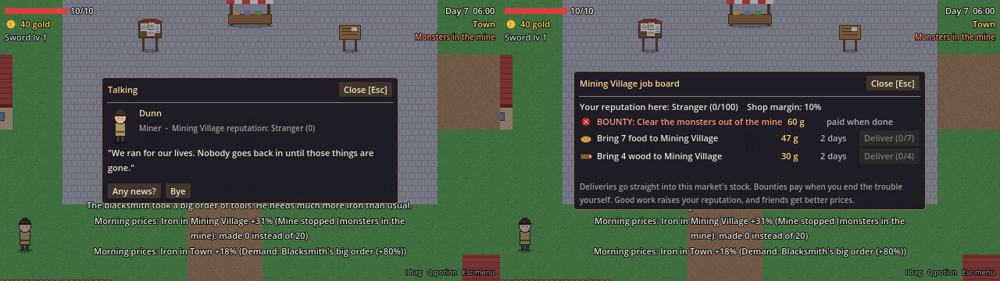
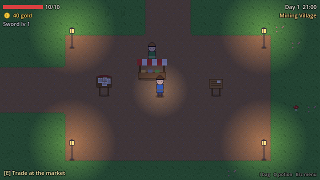

# Bước 5: Gói B, C, D - thị trường sống động, NPC, đồ họa

## Chơi thử (bạn làm)

F5 → New game, rồi thử:

1. Đọc HUD mỗi sáng: dòng **"Morning prices: ..."** cho biết món nào lên hoặc xuống mạnh nhất và vì sao.
2. Nói chuyện (E) với **Hob** (nông dân), **Old Tilda**, **Sergeant Pike** (lính gác ở cổng đông Town), **Mira** (sau sạp chợ Town), và ở làng thì có **Dunn**, **Elsa**, **Oskar**. Hỏi **"Any news?"**. Bạn cũng nên hỏi Greta ở quán trọ.
3. Hỏi thương nhân **"Prices elsewhere?"**: họ chỉ món nào đang chênh giá giữa hai chợ.
4. Đọc **bảng việc làm** (bảng có giấy ghim, cạnh chợ). Khi một món thiếu hàng, làng sẽ đăng việc nhờ chở tới. Khi có sự kiện lớn thì có tiền thưởng.
5. Mua bán nhiều liền: giá **nhích ngay** sau mỗi lần bấm, không cần chờ tới nửa đêm.
6. Đi dạo buổi tối: đèn đường ở hai quảng trường sáng dần, và nhân vật có đèn lồng nhỏ. Người dân về nhà lúc 21 giờ và quay lại lúc 6 giờ.

---

## B. Thị trường sống động

| Thay đổi | Chi tiết |
|---|---|
| **7 sự kiện nhỏ** (`data/events/minor/`) | Lễ hội (Town ăn nhiều hơn 40%), đơn hàng lớn (Blacksmith cần gấp 1.8 lần sắt), mạch quặng giàu (mỏ +50%), sói phá trại (farm -40%), thảo dược nở rộ, rét đậm ở làng (cần gấp 1.8 lần gỗ), bão (tiều phu -50%). Mỗi ngày có 45% khả năng một sự kiện mới bắt đầu, kéo dài 2 đến 6 ngày, và không quá 2 sự kiện cùng lúc. |
| **Dao động hằng ngày** | Sản lượng và nhu cầu mỗi ngày lệch ngẫu nhiên tối đa ±7%, nên giá không bao giờ đứng yên hẳn. |
| **Giá nhích ngay** khi bạn mua bán | Mua bằng 1/10 lượng chợ muốn giữ thì giá tăng khoảng 5% ngay lập tức. Bán thì ngược lại. |
| **Giá phản ứng nhanh hơn** | Smoothing 0.15 → 0.2, Elasticity 0.6 → 0.7 (`data/commodities/*.tres`). |
| **Tin giá buổi sáng** | Mỗi sáng HUD báo 1 đến 2 biến động lớn nhất (từ 8% trở lên) kèm lý do. |
| **Cột "Today"** trong shop | Giá hôm nay so với hôm qua. |

Nguyên tắc vẫn giữ nguyên: sự kiện nhỏ **chỉ nhân sản lượng của một cơ sở hoặc nhu cầu của một nơi**, và giá tự phản ứng. Market Board ghi rõ tên sự kiện trong phần "why".

## C. NPC có chuyện để nói

| Thay đổi | Chi tiết |
|---|---|
| **9 NPC có tên và vai trò** | Mỗi người nói theo tình hình **thật** của thế giới (`game/world/dialogue.gd`). Ví dụ, khi làng thiếu lương thực, thợ mỏ than giá bánh mì với con số đúng giá hiện tại. |
| **Tin đồn trước sự kiện 2 ngày** | Trước khi quái chiếm mỏ hay cướp xuất hiện, sự kiện ở trạng thái "sắp xảy ra" 2 ngày, và NPC thì thầm về nó. Biết sớm thì bạn có thể mua sắt tích trữ. |
| **Mẹo giá của thương nhân** | So sánh 2 chợ và chỉ món chênh nhiều nhất. |
| **Bảng việc làm** (`game/world/job_system.gd`) | Việc giao hàng xuất hiện khi một món ở mức "Low" hoặc "Shortage", mỗi nơi tối đa 2 việc, có hạn 4 ngày, trả 1.25 lần giá chợ. Hàng giao **được đưa vào kho chợ đó**, nên bạn thật sự giải quyết được chỗ thiếu. Tiền thưởng: dọn mỏ 60g, dẹp cướp 80g, chỉ trả khi **chính bạn** kết thúc sự kiện. |
| **Uy tín** mỗi nơi (0 đến 100) | Mỗi việc giao hàng +6, mỗi tiền thưởng +15. Uy tín càng cao thì chênh lệch mua/bán ở chợ đó càng nhỏ (từ 10% xuống 4%). Danh hiệu: Stranger → Known → Friend → Hero. |
| **Người đi lại** | Dân làng đi dạo quanh chỗ của mình ban ngày và về nhà ban đêm. |

Chỉnh không cần code: tên, vai trò, bán kính đi dạo, có ngủ đêm hay không của NPC đều nằm trong Inspector (mở `world.tscn`, chọn NPC, nhóm **Person**).

## D. Đồ họa

| Thay đổi | Chi tiết |
|---|---|
| **Vẽ lại bộ ô** `world_tiles.png` | Cỏ có ngọn, đất có sỏi, đá lát có khối, cây nhiều tầng lá, mái ngói, cửa sổ sáng, hàng rào và ruộng chi tiết hơn. Vẫn 14 ô theo đúng thứ tự cũ. |
| **Viền cỏ** `grass_edges.png` | Cỏ lấn nhẹ lên mép đường đất, đá lát, ruộng, mặt nước, thay cho các cạnh vuông cắt thẳng. |
| **Hoa, sỏi, cỏ, nấm** `decor.png` | Khoảng 11% ô cỏ có đồ trang trí. Vị trí cố định theo ô, không đổi mỗi lần chơi. |
| **Nước lấp lánh** `water_anim.png` | 3 khung chuyển động. |
| **Đèn đường và đèn lồng** | 8 đèn ở 2 quảng trường và 1 đèn lồng quanh nhân vật, tự sáng dần khi trời tối. |
| **NPC mới** | Lính gác, bà cụ, bảng việc làm. |

Phần trang trí được thêm **lúc bản đồ tải** (`game/world/world_decor.gd`), dựa trên những gì đang vẽ trong lớp `Ground`. Vì vậy khi bạn tự sửa bản đồ trong editor, viền cỏ và hoa lá vẫn tự đúng. Trong editor bạn chỉ thấy các ô gốc; viền và hoa chỉ hiện khi chạy game.

Thay ảnh (không code): ghi đè `grass_edges.png` (16 ô 32×32; ô số N có cỏ ở cạnh trên nếu N có bit 1, phải = 2, dưới = 4, trái = 8), `decor.png` (8 ô), `water_anim.png` (3 khung), `lamp.png`.

## Test

- `tests/test_simulation.tscn`: **39/39 đạt**. Thêm các kiểm tra: dao động hằng ngày, sự kiện nhỏ (64 lần trong 200 ngày, đủ 7 loại), lễ hội và mạch quặng thay đổi đúng số liệu, tin đồn có trước sự kiện đúng 2 ngày, giá nhích ngay khi mua bán, việc làm, uy tín, tiền thưởng.
- `tests/test_gameplay.tscn`: **43/43 đạt**. Thêm các kiểm tra: nói chuyện với Hob, mở bảng việc làm, NPC về nhà ban đêm, viền cỏ, hoa lá, 8 đèn đường.

## Giới hạn

- Hội thoại bằng tiếng Anh, như phần còn lại của game.
- NPC đi xuyên qua vật cản trong phạm vi nhỏ quanh chỗ đứng (chưa tìm đường).
- Ảnh vẫn là placeholder do mình vẽ, chỉ chi tiết hơn bản trước.
